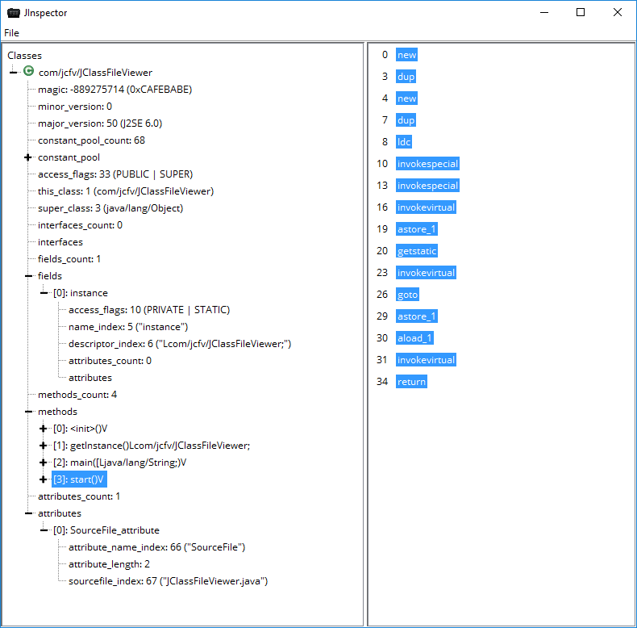

# jinspector
Java class file format parser and graphical representation

## Description
You can open a .class-File up to Java 7. JInspector displays the content of the File in a nice and readable Tree-View.

## Implementation
- Graphical user interface written in old school Swing.
- Handcrafted class file format parser as described in the [specification](https://docs.oracle.com/javase/specs/jvms/se7/html/jvms-4.html).
- Provides a bytecode overview of the selected method.

## Screenshot

